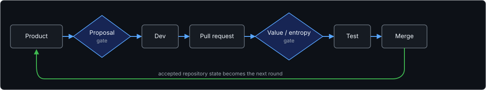

<p align="center">
  
</p>

<h1 align="center">Min Entropy Dev</h1>

<p align="center">
  <strong>Make repositories evolve, not merely grow.</strong><br>
  AI made code cheap. Value is still scarce.
</p>

<p align="center">
  
  
  
</p>

<p align="center">
  <a href="docs/README.md">Documentation</a> ·
  <a href="docs/architecture.md">Architecture</a> ·
  <a href="docs/reward-model.md">Reward model</a> ·
  <a href="README.zh-CN.md">简体中文</a>
</p>

> [!IMPORTANT]
> Min Entropy Dev is an early research prototype. The current reference path
> uses GitHub, Claude Code, and a Node.js/React target repository.

## What's Min Entropy Dev?

Min Entropy Dev is a multi-agent development orchestrator for autonomous
repository evolution. Product, development, rubric, and testing agents work
through a pull request loop in which every candidate change is proposed,
implemented, evaluated, and verified before it can be merged.

The repository is the optimization target. Each PR is a candidate mutation;
the gates provide selection pressure. The loop tracks the value and engineering
entropy introduced by accepted changes so that development can optimize the
trajectory of the project, not merely the next patch.

<p align="center">
  
</p>

## Why Min Entropy Dev?

Coding agents dramatically increase the rate at which code can be produced.
But generating more code does not guarantee that a project becomes more
valuable. If feature completion is the only merge criterion, code can
accumulate faster than product value, reducing value density and making every
future change harder to understand, verify, and operate.

Min Entropy Dev explores whether explicit value and entropy gates can make
autonomous software development compound in a healthier direction: toward
higher verified value with controlled engineering cost.

## How to Use

### Prerequisites

- Git and the GitHub CLI (`gh`), authenticated for a dedicated test repository.
- A recent Node.js runtime.
- Claude Code installed and authenticated.
- A Serper API key if the Product Manager should use web search.

> [!WARNING]
> Development agents can execute shell commands and modify the target
> repository. Use an isolated workspace, branch protection, and least-privilege
> credentials. Do not point this prototype at a production repository without
> reviewing its permissions and checks.

```powershell
git clone https://github.com/zl007700/min_entropy_dev.git
cd min_entropy_dev
npm install
Copy-Item .env.example .env
# Configure the target repository and credentials in .env
npm run smoke
```

Run one checkpointed iteration:

```powershell
npm run loop -- --run-id first-experiment --rounds 10 --once
```

Run the same command again to advance one round. Artifacts are written to
`runs/<run_id>/`; target checkouts are isolated under
`workspaces/<run_id>/`.

Generate the experiment dashboard:

```powershell
npm run dashboard -- first-experiment
```

## Documentation

- [Architecture](docs/architecture.md): agent roles, gates, revisions, and
  orchestration boundaries.
- [Value and entropy model](docs/reward-model.md): running reward and the
  fusion of engineering metrics with agent judgment.
- [Experiment methodology](docs/experiment-methodology.md): baseline and test
  branches, artifacts, and final human evaluation.

The first public reference experiment will use **Valuable Agent**, a deliberately
small React agent that evolves only through this loop.

## Status

The architecture, rubrics, entropy model, and public interface are still under
active experimentation. Repository-agnostic adapters and broader language
support are project directions, not completed capabilities.
