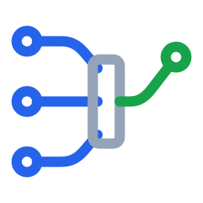
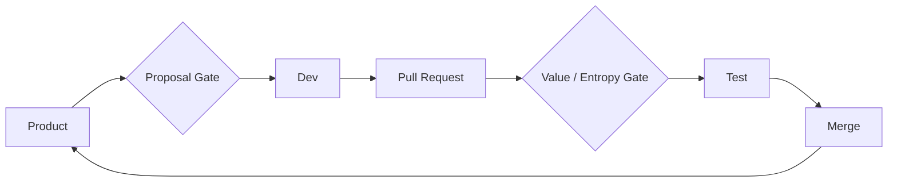

<p align="center">
  
</p>

<h1 align="center">Min Entropy Dev</h1>

<p align="center">
  <strong>让 Repo 持续进化，而不只是持续膨胀。</strong><br>
  AI 让代码变得廉价，但价值依然稀缺。
</p>

<p align="center">
  
  
  
</p>

<p align="center">
  <a href="docs/README.md">Documentation</a> ·
  <a href="docs/architecture.md">Architecture</a> ·
  <a href="docs/reward-model.md">Reward Model</a> ·
  <a href="README.md">English</a>
</p>

> [!IMPORTANT]
> Min Entropy Dev 仍是早期研究原型。当前参考路径基于 GitHub、Claude Code
> 和 Node.js/React 目标仓库。

## 什么是 Min Entropy Dev？

Min Entropy Dev 是一个面向 Repo 自主进化的多智能体研发编排器。Product、
Dev、Rubric 和 Tester Agent 围绕 Pull Request 循环协作；每个候选变更只有
经过提案、实现、评估和验证后才能 Merge。

真正的优化对象是 Repo，而不是单次代码生成。每个 PR 是一次候选变异，Gate
提供选择压力。循环持续追踪被接受变更带来的价值和工程熵，从而优化项目的长期
演化轨迹，而不只是眼前的一个 Patch。



## 为什么需要 Min Entropy Dev？

Coding Agent 大幅提高了代码产生的速度，但更多代码并不保证项目变得更有价值。
如果“功能已经实现”是唯一的 Merge 标准，代码可能比产品价值增长得更快，价值
密度随之下降，后续每次修改也会变得更难理解、验证和运维。

Min Entropy Dev 探索的是：明确的价值与工程熵门禁，能否让自主研发产生更健康
的长期复利，使 Repo 向更高可验证价值、可控工程成本的方向进化。

## 如何使用

### 前置条件

- Git 与 GitHub CLI (`gh`)，并已登录用于实验的专用测试 Repo。
- 较新的 Node.js Runtime。
- 已安装并登录 Claude Code。
- 如果 Product Manager 需要自主搜索，则需要 Serper API Key。

> [!WARNING]
> Dev Agent 能执行 Shell 命令并修改目标 Repo。请使用隔离工作区、分支保护和
> 最小权限凭证。在完成权限与检查项审查前，不要把当前原型指向生产 Repo。

```powershell
git clone https://github.com/zl007700/min_entropy_dev.git
cd min_entropy_dev
npm install
Copy-Item .env.example .env
# 在 .env 中配置目标 Repo 与凭证
npm run smoke
```

运行一个带检查点的迭代：

```powershell
npm run loop -- --run-id first-experiment --rounds 10 --once
```

再次执行同一命令即可推进下一轮。运行产物写入 `runs/<run_id>/`，目标仓库
工作区位于 `workspaces/<run_id>/`。

生成实验 Dashboard：

```powershell
npm run dashboard -- first-experiment
```

## Documentation

- [架构设计](docs/architecture.md)：Agent 角色、Gate、修改循环和编排边界。
- [价值与工程熵模型](docs/reward-model.md)：Running Reward，以及工程指标与
  Agent 判断的融合方式。
- [实验方法](docs/experiment-methodology.md)：Baseline/Test Branch、运行产物和
  最终人工评估。

首个公开参考实验将使用 **Valuable Agent**：一个刻意保持简单，并且只通过这套
循环演化的 React Agent。

## 当前状态

架构、Rubric、工程熵模型和公共接口仍在实验中。Repo Adapter 与更多语言支持
是明确的项目方向，但还不是已经完成的能力。
