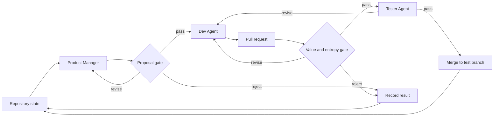

# Architecture

Min Entropy Dev coordinates independent agents around a checkpointed GitHub
pull request loop. The orchestrator owns state transitions and enforcement; the
agents own product, implementation, evaluation, and test decisions.

## Development Loop

## Agent Roles

| Agent | Responsibility | Current tool surface |
| --- | --- | --- |
| Product Manager | Inspect product state and propose one testable increment | Repository read and focused web search |
| Proposal Rubric | Estimate value and entropy before implementation | Supplied repository and proposal evidence |
| Dev | Implement an accepted proposal and revise its PR | Repository read/write and shell access |
| Post-PR Rubric | Verify value and assess structural risk | PR diff, checks, metrics, and repository context |
| Tester | Validate acceptance criteria and regressions | Repository read, shell, and supplied PR evidence |

Every evaluator runs in a separate session with a fixed role and rubric. This
reduces context coupling between the agent that produced a change and the
agents responsible for judging it.

## Orchestrator Boundary

The orchestrator may:

- Create experiment and iteration branches.
- Start agents with the evidence appropriate to their roles.
- Create, comment on, merge, or close pull requests according to gate results.
- Persist artifacts, heartbeats, state, and reports.
- Pause and resume an interrupted evaluation.

The orchestrator must not:

- Invent a product proposal when the Product Manager fails.
- Repair implementation work on behalf of the Dev Agent.
- Replace a failed rubric or test evaluation with a fallback decision.
- Merge a change that did not pass the required gates.

## Revision and Failure Semantics

- `pass` advances the candidate to the next gate.
- `revise` returns the same proposal or PR to the responsible agent with the
  evaluator's evidence attached.
- `reject` terminates the candidate without merging it.
- An evaluator infrastructure failure pauses the run and preserves the open PR
  for inspection and resumption.
- Agent failures are recorded as failed rounds rather than silently converted
  into valid results.

No arbitrary agent turn limit is used as a proxy for task completion.

## Current Coupling

The orchestration concept is intended to work across repositories, languages,
and frameworks. The current implementation still contains reference-specific
configuration, npm checks, and React-oriented state-surface metrics. A future
repository adapter boundary must separate these concerns from the generic loop.
